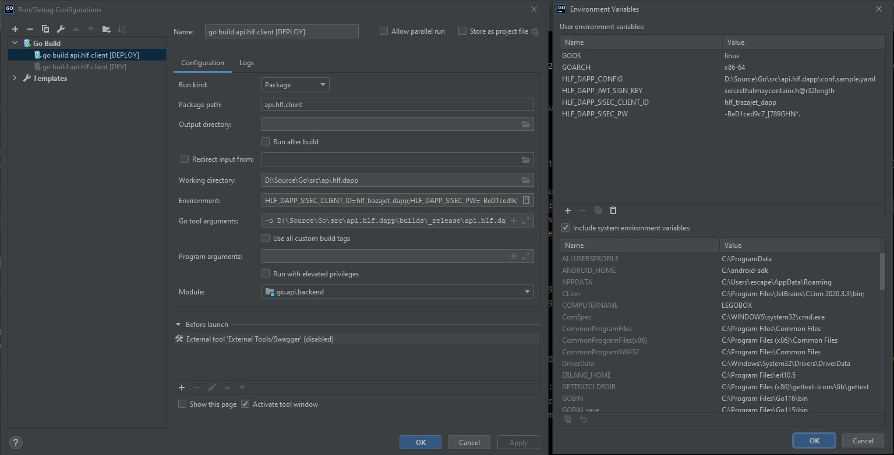

## 🚀 Deployment

### Environment Variables
#### Dapp vars

We need to set up the fallowing environments variables in the aplication server
* **HLF_DAPP_CONFIG**
   
    We use this to define the path to the dapp config file.
   
* **HLF_DAPP_JWT_SIGN_KEY**

    The value of this env var will be used to sign the JWT token for 
    authentication purpose. Must be a string of 32 characters.

* **HLF_DAPP_SISEC_CLIENT_ID** | **HLF_DAPP_SISEC_PW** 

    Are the credential to use the SISEC authentication endpoint 

To add this env var we could do the following:

```shell
nano ~/.profile
```

```shell
export HLF_DAPP_CONFIG="/path/to/the/dapp/config/conf.sample.yaml"
export HLF_DAPP_JWT_SIGN_KEY="secret_sample_with_32_chars"
export HLF_DAPP_SISEC_CLIENT_ID="id_str"
export HLF_DAPP_SISEC_PW="the_password"
```

After that just update with

```shell
source ~/.profile
```

#### Go vars
          
In addition to the previous var, we have to set the following so Go can 
perform properly:

```shell
go env -w GOPRIVATE=github.com/ic-matcom
export GOPATH=$HOME/go-path
export PATH=$PATH:/usr/local/go/bin:$GOPATH/bin
export GOPROXY="https://goproxy.cn,direct"
export GO111MODULE=on
```
The first line is for the inclusion of a private github repo

### Deployment Steps

❗ These steps should be done in the server that will serve the application

0. Copy [crypto-materials](https://github.com/ic-matcom/api.dapp/blob/main/docs/deployment.md#crypto-materials) 
   folder, the [configuration file](https://github.com/ic-matcom/api.dapp/blob/main/docs/deployment.md#configuration-file) 
   and the HLF connection profile (cpp) to the server.
1. Make sure all the env var were set up properly
2. Create a folder to serve the Dapp API, and run the following command inside:
   
```shell 
git clone  https://github.com/ic-matcom/api.dapp.git
cd api.dapp.git
```                

3. Install Swagger api documentation running this command:

```shell
# versions of go prior to 1.17 
go get -u github.com/swaggo/swag/cmd/swag@v1.7.0

# versions of go greater than 1.17
go install github.com/swaggo/swag/cmd/swag@v1.7.0
```

4. Edit the Api documentation host IP in the _main.go_ file. 
   Seek the line with  ```// @host 192.168.49.131:8080``` and set
   the correspondent server IP address. This is only for 
   Api documentation purpose.
   

5. Generate the Api documentation:
        
```shell
swag init --parseDependency --parseInternal --parseDepth 1
go get
```

6. Run the dapp with ``` go run main.go ```

#### Alternative A
Next to the steps #5 (bifurcation in the steps) we could install the app as 

```shell
go build -i -o /home/portainer/go-path/bin/api.dapp
```
That install the dapp in the indicated go path bin directory. Then we could run 
the dapp with just ```./api.dapp``` from the mentioned directory. 

#### Alternative B
Next to the steps #1 (bifurcation in the steps) we could build the binary using
cross compilation [ [1](https://dave.cheney.net/2015/08/22/cross-compilation-with-go-1-5) ] [ [2](https://stackoverflow.com/questions/38583853/how-to-deploy-an-iris-go-web-framework-project) ]
with the Goland IDE help, using a build template as the picture below shows.



Then we could copy the file to the sever and run the dapp with just ```./api.dapp```.

❗ Both alternative A and B have to run steps #4 and #5.   

### Configuration file

The configuration file (dapp.conf.yaml) is an important part of the deployment process. You must
review te configuration file to complete the deployment process. There are some self-explanatory
configurations, but others not that much:

* **JWTSignKey** secret key to sign the Auth Bearer tokens
* **IpfsAddress** IPFS API address to handle the IPFS node
* **IpfsGateway** HTTP IPFS gateway for accessing the files
* **MspId** Root MSP name for the dapp identities
* **CryptoMaterialsDir** Path for the directory that holds the certs (.pem) and private keys for
  HLF dapp identities
* **DappIdentityUser** and **DappIdentityAdmin** are the labels of the two identities used by the dapp
  to authenticate its operations against the HLF network.
* **CppPath** connection profile path, so the system can know some network specifications

❗ The configuration file must be alongside of the dapp binary, in the same location. 

### Crypto Materials

The dapp need to authenticate itself to the HLF network. It must be done with the certificate and
the private key (credentials), used to talk with HLF network. So we need to provide that files so 
the dapp can perform the normal privilege and admin privilege operations with the network.

So wee need to match the following structure inside the ```crypmaterials\msp``` folder:

```
crypmaterials
└─── msp
│   │   readme.md
│   └───<user_creds_label>
│   │   └─── keystore
│   │   │             priv_sk
│   │   │  
│   │   └─── signcerts
│   │                 cert.pem  
│   └───<admin_creds_label>
│   │   ... same struct as the other user
└─── wallets    
```

### Things you should know 

1. The identities private key must be with the name **priv_sk** inside respective **kystore** folder
2. We need to use a **connection profile** (CPP) from the HLF network, so the SDK can establish connection with the network.
3. We can test post to the ledger through its UI (user: _admin_ | pass: _adminpw_).
   http://192.168.49.131:5984/_utils/
4. The dApp hosts, and the peers most be inside a time widows of 15 minutes.  
